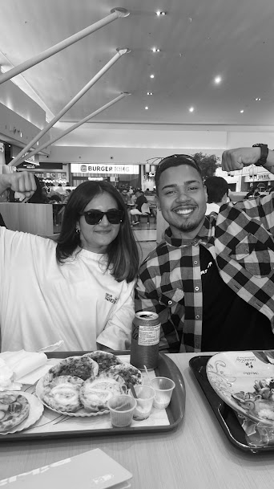

<!DOCTYPE html>
<html lang="pt-BR">
<head>
    <meta charset="UTF-8">
    <title>🎉 FELIZ ANIVERSÁRIO BARB!!! 🎉</title>
    
</head>
<body>
    <!-- Tela inicial -->
    

        <button id="startBtn">Start</button>
    

    <!-- Conteúdo principal -->
    

        <h1>🎂 Feliz Aniversário, BARB! 🎂</h1>
        
        
HEY JESUS!!! Que o próximo ano seja BALA MÁXIMA! Com muita bênção, roles e JESUS 🙏!

        <button class="surpresaBtn" id="surpresaBtn">Clique para a surpresa</button>

        <audio id="musica" loop>
            <source src="surpresa.mp3" type="audio/mpeg">
            Seu navegador não suporta áudio.
        </audio>
    

    
</body>
</html>
